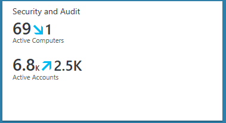
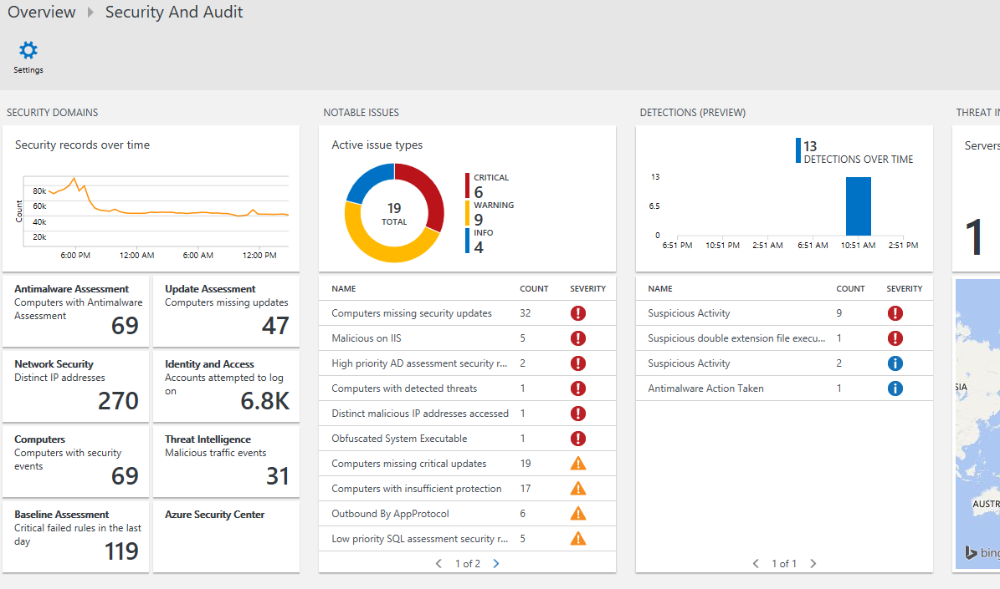
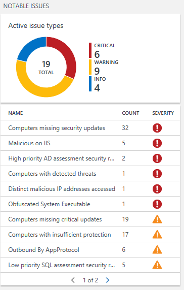
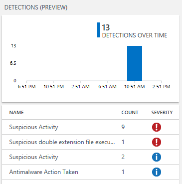
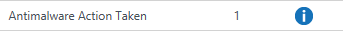
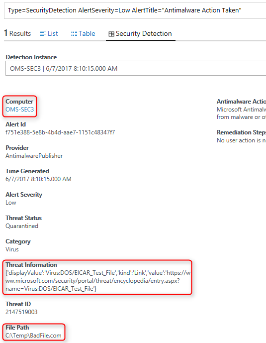
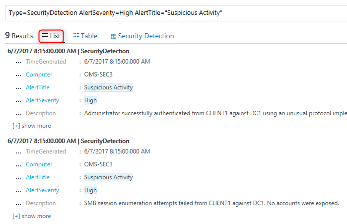
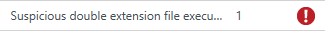
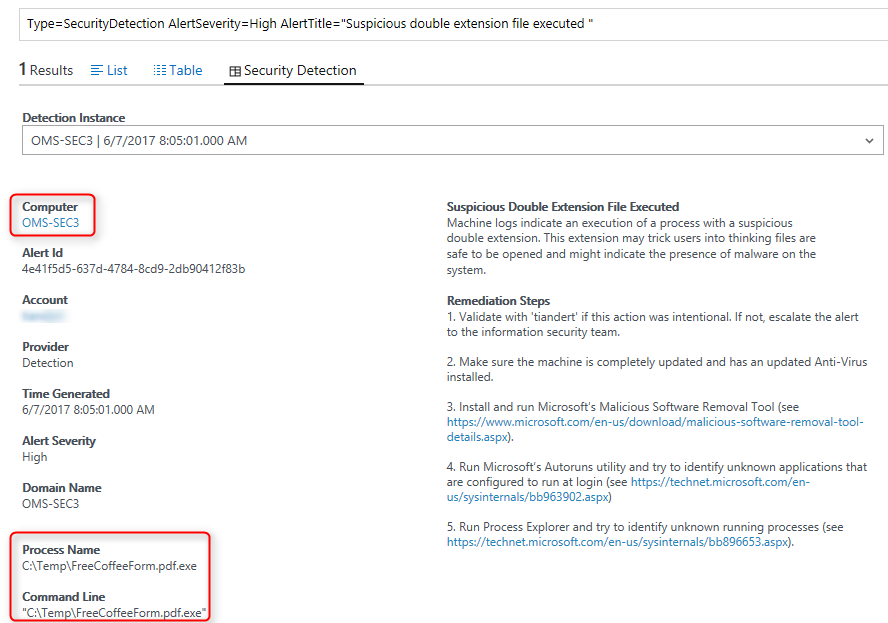

# OMS Security Demo and Lab Instructions

The following lab instructions are intended as a foundation to walk through, demonstrate and understand the basics of the Operations Management Suite (OMS) Security & Audit solution pack.
For this lab we will leverage the **OMS Experience Center 2016** workspace.

***Note:***
*Please note that security demo's which can cause potential risks of VM's being breached - like opening ports and exposing unpatched systems to the Internet - are excluded from this lab*

### Objectives
In this lab we will walk through the following scenario's of the Security & Audit solution pack:
* Anti-Malware
* Suspicious Activities
* ATA (Advanced Threat Analytics)
* Double extension file execution
* Computer with detected threats
* Malicious IP's hitting your webserver
* Members added to security enabled groups
* User accounts created or enabled
* View outbound traffic by protocol

This lab has been designed to leverage a mixture of dashboards and - specifically to showcase forensic type of investigation demo's - search queries.

## Demo script artifacts
These labs are supported by running PowerShell scripts on a designated Azure VM which is reporting data to the OMS Experience Center 2016 workspace. These scripts will run twice a day to generate the necessary data.

## Lab 1 - Exploration of Security Dashboards
*In this lab exercise we will start exploring the security dashboards*

1. Open the OMS Experience Center 2016 workspace
2. Click on the Security And Audit solution tile:
 

 
 
 
3. This brings you to the Security And Audit landing page:
 
4. At a glance you will see on the left hand side Security Domains, like Antimalware Assessment, Update Assessment, Network Security, etc. These tiles are all drill down capable and will give more detailed information per domain
5. The Notable Issues summarizes issues which are highlighted for you to explore:
 

7. The scripts which are running on a VM to generate security data is populating the Notable Issues, but also the Detections view:
 

## Lab 2 - Anti-Malware
Since we don't want our VM's to be infected with malware, we are running a script which will download an Eicar file. This triggers all anti-malware solutions and will generate an alert for us.
1. Click under Detections (Preview) on Antimalware Action Taken:

2. This brings you to the Log Search view where you can see details like on which computer did this happen and what they threat information and file path is:

3. Note that you can switch between "List", "Table" and "Security Detection" for different views

## Lab 3 - ATA & Suspicious Activities
The data we generate for ATA is being flagged as "suspicious activities" and can be found (as the previous excercise) under "Detections (Preview)"
1. Click on "Suspicous Activity"
2. Switch from "Security Detection" to the "List" view to see more details:

## Lab 4 - Double extension file execution
One of the known obfuscation techniques being used is to mask an executable to that it looks innocent for the user to execute.
One of the scripts being used in our labs will download an executable and will use the PDF extension to let the user believe he's opening a PDF file instead of executing an EXE file.
1. Under "Detections (Preview)" click on "Suspicious double extension file execution":

2. This will show information which reveals the process name and executable being invoked while trying to confuse the user and trying to look like a PDF file:

