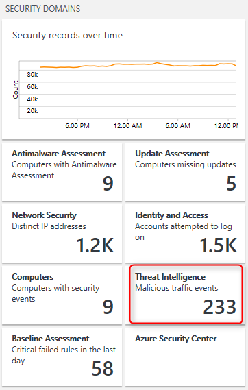

# OMS Security Demo and Lab Instructions

The following lab instructions are intended as a foundation to walk through, demonstrate and understand the basics of the Operations Management Suite (OMS) Security & Audit solution pack.
For this lab we will leverage the **OMS Experience Center 2016** workspace.

***Note:***
*Please note that security demo's which can cause potential risks of VM's being breached - like opening ports and exposing unpatched systems to the Internet - are excluded from this lab*

### Objectives
With the help of labs we will walk through the following scenario's of the Security & Audit solution pack:
* Anti-Malware
* Suspicious Activities
* ATA (Advanced Threat Analytics)
* Double extension file execution
* Threat Intelligence
* Identity & Access

More advanced scenario's leveraging log search:
* Malicious IP's hitting your webserver
* Users created, changed and/or added to security groups
* View outbound traffic by protocol
* Processes being executed on a specific server
* ...

This lab has been designed to leverage a mixture of dashboards and - specifically to showcase forensic type of investigation demo's - search queries.

## Demo script artifacts
These labs are supported by running PowerShell scripts on a designated Azure VM which is reporting data to the OMS Experience Center 2016 workspace. These scripts will run twice a day to generate the necessary data.

### Lab 1 - Exploration of Security Dashboards
*In this lab exercise we will start exploring the security dashboards*

1. Open the OMS Experience Center 2016 workspace
2. Click on the Security And Audit solution tile:
 

 
 
 
This brings you to the Security And Audit landing page:
 
At a glance you will see on the left hand side Security Domains, like Antimalware Assessment, Update Assessment, Network Security, etc. These tiles are all drill down capable and will give more detailed information per domain

The Notable Issues summarizes issues which are highlighted for you to explore:
 

The scripts which are running on a VM to generate security data is populating the Notable Issues, but also the Detections view:
 

### Lab 2 - Anti-Malware
Since we don't want our VM's to be infected with malware, we are running a script which will download an Eicar file. This triggers all anti-malware solutions and will generate an alert for us.
1. Click under Detections (Preview) on Antimalware Action Taken:
 

This brings you to the Log Search view where you can see details like on which computer did this happen and what the threat information and file path is:

Note that you can switch between "List", "Table" and "Security Detection" for different views

### Lab 3 - ATA & Suspicious Activities
The data we generate for ATA is being flagged as "suspicious activities" and can be found (as the previous exercise) under "Detections (Preview)"
1. Click on "Suspicous Activity"
2. Switch from "Security Detection" to the "List" view to see more details:

### Lab 4 - Double extension file execution
One of the known obfuscation techniques being used is to mask an executable to that it looks innocent for the user to execute.
One of the scripts being used in our labs will download an executable and will use the PDF extension to let the user believe he's opening a PDF file instead of executing an EXE file.
1. Under "Detections (Preview)" click on "Suspicious double extension file execution":

This will show information which reveals the process name and executable being invoked while trying to confuse the user and trying to look like a PDF file:

### Lab 5 - Threat Intelligence
In this excercise we will look at potential threats hitting your systems.
1. On the Security And Audit landing page, click on Threat Intelligence:

This brings us to a view with threat types per country and a nice world map.
Explore the threats by clicking either on the orange pushpins or - in case you have systems responding to those threats - red pushpins.

Under Threat Details you will details about the threat and if a available for that specific threat, a PDF document containing more information:

Opening the PDF report shows something like this:

### Lab 6 - Identity & Access
In this excercise we will look at the default views for everything related to identities and their access.
1. From the Security and Audit landing page, click on Identity And Access:

That takes you to the landing page of Identity & Access:

2. Explore the different tiles and what they can tell you.

## Using Log Search for Security Investigations
### Lab 7 - Failed Logons
The following exercises showcase the strength of using log search across millions of events

**The case of failed logons**
1. Open Log Search
2. If you are new to Log Search, type in the following query (without the double quotes) to demonstrate the strength of search:
"* | Measure count() by Type"

This returns all the data types that Log Analytics has available for you.

Now let's limit the search to Security related events by typing in (without quotes and case sensitive) "Type=SecurityEvent"

That shows all the security data we have. That's a lot right?
Now let's assume for example that you're looking for failed logons across all your systems.
Those will be logged with EventID 4625.

Execute the following query in Log Search (again without quotes): "EventID=4625 | Measure count() by Computer"

This gives you a view at glance how many failed logons occurred by computer.

Let's now sort all accounts that have failed to logon by executing this query "EventID=4625 | Measure count() by Account | Sort Account desc" and sort the account names:

If we want to see all failed logons for a specific computer, we obviously can:

### Lab 8 - Investigate a server for security events
In this excercise we start a broad security investigation, focused on a specific server.
Imagine that you are investigating security alerts which might originate from a specific server.
Let's start by viewing all the security alerts on a specific computer by executing the following query:
"Type=SecurityEvent Computer="DC01-TS.corp.tailspin.com" | dedup Activity"
This search query will return us all security events for a specific computer and will list only once the activity, so that we have a clear view on which security related activities occurred on that machine:

Did you notice the process's which got created?
Let's zoom in on that in the next exercise.
